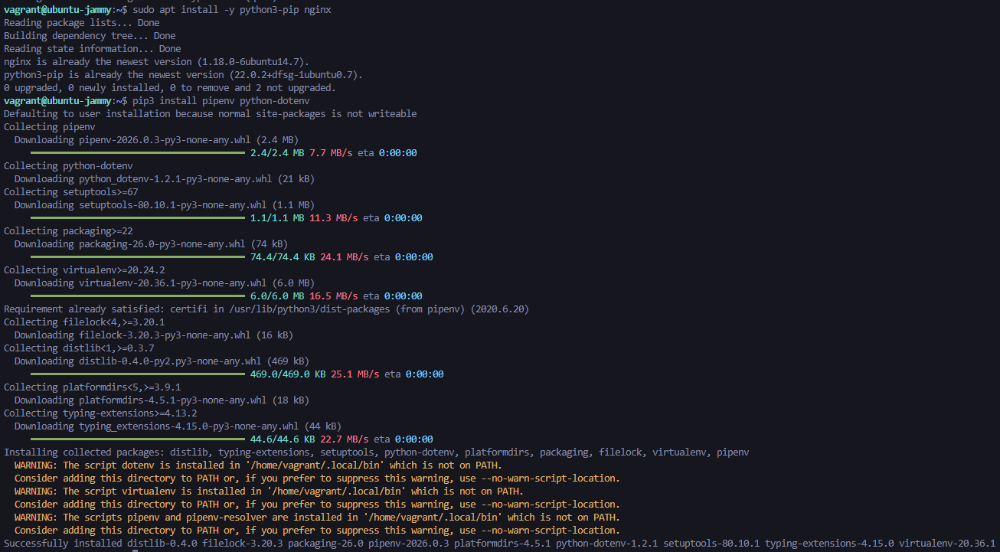
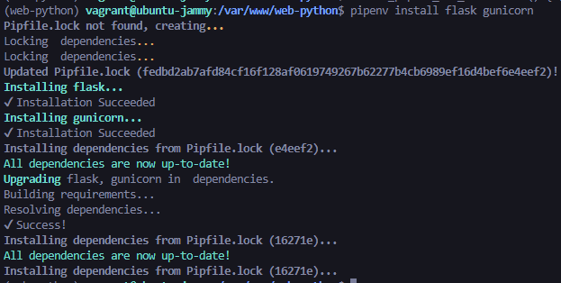
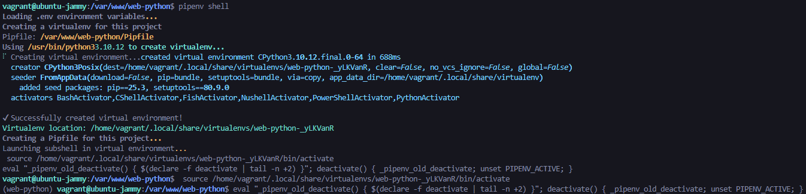
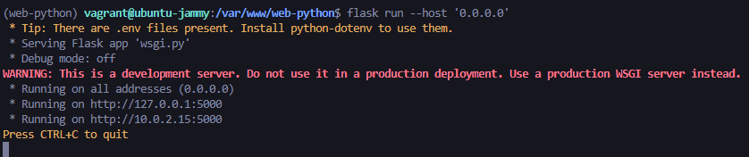
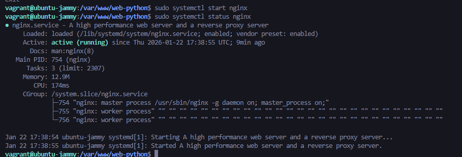
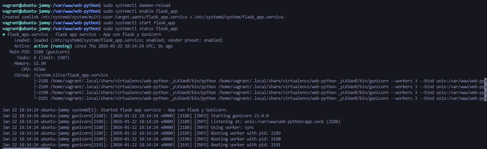
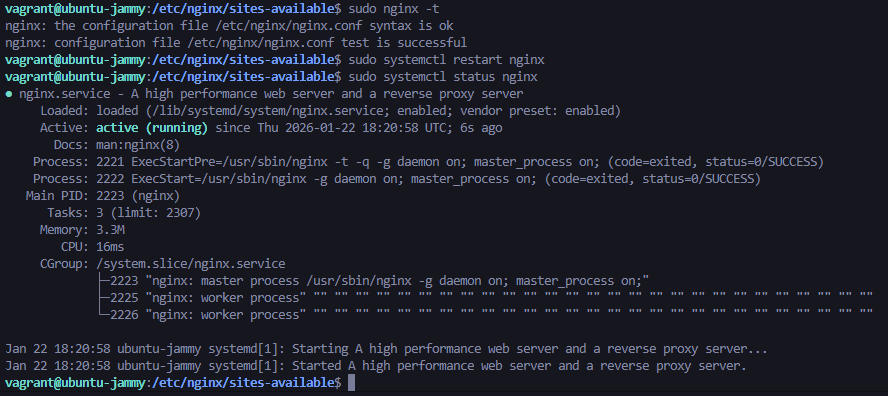

# Despliegue de aplicación Python con Flask y Gunicorn

## 1. Configuración inicial

*Figura 1: Instalación de dependencias básicas*

*Figura 2: Creación del directorio de trabajo con permisos adecuados*

## 2. Pruebas iniciales

*Figura 3: Aplicación funcionando con servidor de desarrollo de Flask*

*Figura 4: Aplicación funcionando con Gunicorn 'Se me olvido hacer la captura de esto'*

## 3. Configuración como servicio

*Figura 5: Estado del servicio systemd*

*Figura 6: Servicio flask_app activo y funcionando*

## 4. Configuración de Nginx

*Figura 9: Configuración de Nginx como proxy inverso*